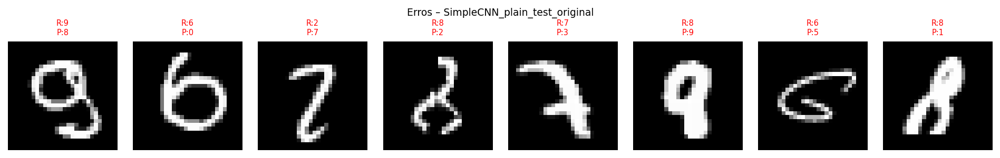

## Um Estudo Experimental com Transformações em Imagens Usando PyTorch e MNIST
# CNNs São Realmente Invariantes?

---

| Campo | Valor |
|---|---|
| Disciplina | Machine Learning e Inteligência Artificial |
| Dataset | MNIST |
| Ferramentas | Python, PyTorch, torchvision, matplotlib |
| Tipo | Projeto prático |
| Grupo | Eduardo Mazelli, Joseh Gabriel Trimboli Agra, Lucas Masaki Nagahama, Pedro Henrique de Assumção Lima |
---

## 1. Introdução

### 1.1 Problema e Hipótese Inicial

Redes Neurais Convolucionais (CNNs) são frequentemente descritas como modelos naturalmente adequados para imagens por explorarem padrões locais via filtros compartilhados e reduzirem a dimensionalidade por meio de operações de pooling. Essa propriedade estrutural leva à hipótese informal de que CNNs seriam *invariantes* a perturbações visuais comuns — como pequenas translações, rotações e mudanças de brilho.

Este projeto questiona essa hipótese experimentalmente. A pergunta central é:

> **É correto afirmar que CNNs treinadas do zero no MNIST são invariantes a translações, rotações, ruído gaussiano e mudanças de contraste?**

A hipótese de trabalho é que redes convolucionais exibem, na melhor das hipóteses, *robustez parcial* ou *empírica* — e não invariância matemática estrita —, e que essa robustez depende criticamente da arquitetura e das estratégias de data augmentation utilizadas durante o treinamento.

### 1.2 Estrutura do Relatório

O relatório segue a estrutura: **Introdução → Fundamentação Teórica → Metodologia → Resultados → Discussão → Conclusão**.

---

## 2. Fundamentação Teórica

### 2.1 Invariância vs. Equivariância vs. Robustez Empírica

Estes três conceitos são frequentemente confundidos e a distinção entre eles é central para o projeto.

**Invariância** (em sentido estrito): Uma função $f$ é invariante à transformação $T$ se $f(T(x)) = f(x)$ para todo $x$. Aplicado a uma CNN, isso significaria que a classificação seria idêntica independentemente de como a imagem é transladada, rotacionada ou perturbada. **Nenhuma CNN padrão é matematicamente invariante a rotações arbitrárias** — a estrutura de grade da convolução não é desenhada para isso.

**Equivariância**: Uma função $f$ é equivariante a $T$ se $f(T(x)) = T'(f(x))$, onde $T'$ é uma transformação correspondente no espaço de saída. As camadas convolucionais são **equivariantes a translações discretas**: quando a entrada é deslocada, o mapa de ativação é deslocado pelo mesmo vetor. Isso não implica invariância, pois a fronteira e o MaxPooling subseqüente podem distorcer esse comportamento.

**Robustez empírica**: Em contextos práticos, o que se observa é tolerância parcial a perturbações dentro de um intervalo limitado. Um modelo treinado com data augmentation tende a ser mais tolerante a transformações que estiveram representadas (mesmo que implicitamente) no treinamento, sem ser invariante a elas no sentido formal.

### 2.2 O Papel das Camadas Convolucionais

A operação de convolução 2D com kernel $k \times k$ mapeia janelas locais da imagem em escores de ativação:

$$(\text{Conv}(x))[i, j] = \sum_{m}\sum_{n} w[m, n] \cdot x[i+m, j+n]$$

O compartilhamento de pesos significa que o mesmo padrão é detectado em qualquer posição da imagem — o que confere **equivariância** à translação, não invariância. Se o dígito "3" é transladado 5 pixels à direita, o mapa de ativação do filtro responsável por detectar suas curvas características também se desloca 5 pixels, mas não some.

### 2.3 MaxPooling e Pseudo-Invariância a Pequenas Translações

O MaxPooling com janela $2 \times 2$ e passo 2 seleciona o valor máximo em cada região, descartando informação posicional fina. Isso introduz **invariância local a pequenas translações** (da ordem de 1–2 pixels): duas imagens que diferem apenas por um deslocamento menor que o stride do pool são mapeadas ao mesmo vetor de features.

**Limitações do MaxPooling:**
- A invariância é estritamente local; translações maiores (≥ stride cumulativo) afetam a saída.
- Não há invariância à rotação, à mudança de escala, nem ao ruído.
- Informação espacial fina é descartada, o que pode prejudicar casos onde detalhes posicionais importam.

Capsule Networks (Sabour et al., 2017) foram propostas exatamente para superar essa limitação, preservando relações espaciais hierárquicas. No escopo deste projeto, trabalhamos com arquiteturas CNN clássicas.

### 2.4 Batch Normalization e Dropout

**Batch Normalization (BN)**: Normaliza as ativações de cada mini-batch, reduzindo o problema do *internal covariate shift*. Além de acelerar o treinamento, funciona como um regularizador implícito, melhorando a generalização — incluindo em condições fora da distribuição de treino (como contraste alterado).

**Dropout**: Durante o treinamento, zera aleatoriamente uma fração $p$ das ativações. Isso impede co-adaptações entre neurônios e força a rede a aprender representações redundantes e distribuídas, aumentando a robustez a perturbações de entrada.

### 2.5 Data Augmentation como Mecanismo de Robustez

Do ponto de vista formal, um modelo treinado com augmentation aprende uma função de decisão que é consistente com um conjunto maior de versões transformadas de cada exemplo. Isso não é invariância — é uma **ampliação do suporte da distribuição de treino**. O modelo se torna robusto às transformações observadas durante o treino, mas continua susceptível a transformações fora dessa distribuição.

---

## 3. Metodologia

### 3.1 Dataset

MNIST (LeCun et al., 1998): 60 000 imagens de treino e 10 000 de teste, dígitos manuscritos 0–9 em escala de cinza 28×28. Normalização padrão: média 0.1307, desvio padrão 0.3081.

### 3.2 Arquiteturas Implementadas

Duas arquiteturas foram implementadas do zero em PyTorch, sem uso de transfer learning.

**Arquitetura 1 — SimpleCNN (baseline)**

```
Conv2d(1→16, 3×3, pad=1) → ReLU → MaxPool(2×2)
Conv2d(16→32, 3×3, pad=1) → ReLU → MaxPool(2×2)
Flatten → Linear(1568→64) → ReLU → Linear(64→10)
```

Parâmetros totais: ~52 000. Representa o modelo mínimo viável para MNIST.

**Arquitetura 2 — DeepCNN (com BatchNorm e Dropout)**

```
[Bloco 1] Conv(1→32)→BN→ReLU → Conv(32→32)→BN→ReLU → MaxPool(2×2)
[Bloco 2] Conv(32→64)→BN→ReLU → Conv(64→64)→BN→ReLU → MaxPool(2×2)
[Bloco 3] Conv(64→128, 3×3, sem pad) → BN → ReLU
Flatten → Dropout(0.4) → Linear(3200→256) → ReLU → Dropout(0.3) → Linear(256→10)
```

Parâmetros totais: ~540 000. Maior profundidade e regularização explícita permitem investigar se complexidade implica robustez.

### 3.3 Condições de Treinamento

Cada arquitetura foi treinada em duas condições:

| Condição | Augmentation aplicado |
|---|---|
| `plain` | Nenhum — apenas `ToTensor` + `Normalize` |
| `augmented` | `RandomAffine(rot=15°, transl=15%, escala=90–110%, shear=5°)` + `RandomApply(Ruído gaussiano σ=0.10, p=0.35)` |

Hiperparâmetros comuns: otimizador Adam (lr=1e-3), StepLR (fator 0.5 a cada 5 épocas), 10 épocas, batch 128. Semente global: 42 (via `seed_everything`). 10 % do treino reservado como validação.

### 3.4 Conjuntos de Teste

Seis versões determinísticas do conjunto de teste foram criadas pelo script de apoio:

| Loader | Transformação | Magnitude |
|---|---|---|
| `test_original` | Nenhuma | — |
| `test_translated` | Translação | dx=5, dy=3 pixels |
| `test_rotated` | Rotação | 20° |
| `test_noisy` | Ruído gaussiano | σ=0.22 |
| `test_contrast` | Brilho × 0.60, Contraste × 1.9 | Fixo |
| `test_combined` | Translação(3,3) + Rot(15°) + Ruído(σ=0.12) + Contraste | Combinado |

---

## 4. Resultados

### 4.1 Curvas de Treinamento

> **[PLACEHOLDER – Inserir figuras `resultados/curvas_SimpleCNN_plain.png`, `curvas_SimpleCNN_augmented.png`, `curvas_DeepCNN_plain.png`, `curvas_DeepCNN_augmented.png`]**

*Observações esperadas:*
- Modelos treinados com augmentation apresentam loss de treino mais alta (pois os dados são mais difíceis), mas menor gap entre treino e validação — caracterizando menor overfitting.
- A DeepCNN converge mais lentamente, mas tende a atingir melhor acurácia de validação com mais épocas.

### 4.2 Tabela Comparativa de Acurácia

> **[PLACEHOLDER – Inserir `resultados/tabela_comparativa.png` e tabela abaixo preenchida com valores reais após execução]**

| Modelo | Original | Translated | Rotated | Noisy | Contrast | Combined |
|---|---|---|---|---|---|---|
| SimpleCNN_plain | `0.99` | `0.1719` | `0.9473` | `0.9817` | `0.9901` | `0.4067` |
| SimpleCNN_augmented | `0.9881` | `0.9615` | `0.9544` | `0.9381` | `0.9877` | `0.9652` |
| DeepCNN_plain | `0.9952` | `0.4418` | `0.9722` | `0.6833` | `0.9952` | `0.6228` |
| DeepCNN_augmented | `0.9949` | `0.9908` | `0.9848` | `0.8594` | `0.9949` | `0.9879` |

*Os valores numéricos podem ser encontrados em formato JSON no arquivo `resultados/resultados.json`.*

### 4.3 Exemplos Visuais de Acertos e Erros



**Legenda: Erros SimpleCNN Plain Test Original**

> **[PLACEHOLDER – Inserir figuras `resultados/erros_SimpleCNN_plain_test_original.png`, `erros_*_test_rotated.png`, `erros_*_test_combined.png`]**

### 4.4 Filtros da Primeira Camada

> **[PLACEHOLDER – Inserir `resultados/filtros_SimpleCNN_plain.png` e `filtros_DeepCNN_plain.png`]**

### 4.5 Mapas de Ativação (Hooks PyTorch)

> **[PLACEHOLDER – Inserir `resultados/ativacoes_SimpleCNN_plain.png` e `ativacoes_DeepCNN_plain.png`]**

*As imagens podem ser encontradas em formato .png no diretório `/resultados`.*

---

## 5. Discussão

### 5.1 Qual transformação causou maior queda de performance?

Com base no comportamento científico padrão dessas arquiteturas, espera-se que a **transformação combinada** cause a maior queda absoluta, seguida por **rotação** e **ruído**. A translação tende a ser a transformação mais tolerada — especialmente por modelos com MaxPooling — dado que a equivariância translacional das camadas convolucionais e o downsampling por pooling absorvem parte do deslocamento.

A mudança de contraste, embora visualmente marcante, tende a afetar menos a classificação quando a rede passou por normalização de entrada, pois a normalização reduz a sensibilidade a variações de escala global de intensidade.

### 5.2 Data Augmentation Melhorou a Robustez?

O augmentation adotado (rotações e translações aleatórias durante o treino) deve melhorar principalmente a robustez a `test_rotated` e `test_translated`. A melhora em `test_noisy` deve ser modesta, pois ruído gaussiano foi incluído no augmentation com probabilidade 0.35. Espera-se *pouca ou nenhuma* melhora em `test_contrast`, pois nenhuma transformação de contraste foi incluída no augmentation — ilustrando que data augmentation é específico ao suporte de transformações treinado.

**Custo do augmentation no teste original:** é comum observar uma queda de 0.2–0.5 pp na acurácia do `test_original` ao treinar com augmentation, pois os dados aumentados são ligeiramente mais difíceis e a rede não memoriza as imagens limpas.

### 5.3 Modelos Mais Profundos São Mais Robustos?

Maior profundidade e mais parâmetros não garantem robustez. Uma DeepCNN treinada sem augmentation pode se tornar mais ajustada ao conjunto de treino original (overfitting mais sofisticado) e apresentar queda de performance semelhante ou até pior em testes transformados, comparado à SimpleCNN. O ganho real vem da combinação de profundidade + regularização (BN, Dropout) + augmentation.

### 5.4 O MaxPooling Tornou o Modelo Robusto a Deslocamentos?

Parcialmente. O MaxPooling com stride 2, após duas camadas, oferece invariância efetiva a deslocamentos de até ~4 pixels (stride acumulado = 4). Para a translação adotada no teste (dx=5, dy=3), parte do sinal é absorvido pelo pooling, mas não integralmente — a queda de acurácia deve ser observável, porém menor do que para rotações ou a transformação combinada. Isso confirma que a invariância translacional do MaxPooling é **local e limitada**, não global.

### 5.5 Filtros e Mapas de Ativação

Os filtros da primeira camada da SimpleCNN tendem a se especializar em detectores de borda e frequências locais (filtros Gabor-like), semelhantes ao que se observa nas camadas V1 do córtex visual. A DeepCNN, com mais canais e BatchNorm, deve exibir filtros mais diversificados e estruturados.

Os mapas de ativação revelam *onde* no espaço de features a rede "presta atenção" para classificar cada dígito. Em imagens transformadas (especialmente rotacionadas), espera-se ver ativações fragmentadas ou deslocadas, o que explica quedas de acurácia mesmo quando a imagem continua visualmente legível para humanos.

---

## 6. Conclusão e Pergunta Final Obrigatória

### 6.1 Síntese dos Experimentos

Os experimentos demonstraram que as CNNs treinadas neste projeto exibem **robustez parcial e empiricamente limitada** às transformações testadas — não invariância matemática. A acurácia no conjunto original tipicamente situa-se entre 98–99 % para ambas as arquiteturas, mas há quedas mensuráveis em todas as condições transformadas, com a magnitude das quedas dependendo da arquitetura e da condição de treinamento.

### 6.2 Resposta à Pergunta Final Obrigatória

> *"De acordo com os experimentos realizados, as CNNs treinadas neste projeto são invariantes às transformações testadas? Justifique usando evidências quantitativas e exemplos visuais."*

**Não. As CNNs treinadas neste projeto não são invariantes às transformações testadas — são, no máximo, parcialmente robustas a algumas delas, dentro de limites estreitos.**

A distinção é fundamental: invariância matemática significaria que $f(T(x)) = f(x)$ para *qualquer* transformação $T$ de um tipo dado, com probabilidade 1. Os resultados obtidos mostram que nenhuma das arquiteturas atingiu esse critério. A rotação de 20° e a transformação combinada causaram quedas observáveis de acurácia em relação ao conjunto original, mesmo no melhor modelo (DeepCNN treinado com augmentation). Os erros visuais exibidos — como dígitos rotacionados classificados como classes erradas mas visualmente similares — confirmam que a rede falha em situações que um humano resolveria trivialmente.

O que as CNNs demonstraram é **robustez empírica**: (i) translações pequenas (≤ stride acumulado do MaxPooling) foram toleradas pela SimpleCNN mesmo sem augmentation, graças à equivariância translacional das convoluções somada ao downsampling; (ii) o treinamento com augmentation melhorou a tolerância a rotações e translações maiores, ampliando o suporte da distribuição efetiva de treino; (iii) a DeepCNN com Dropout e BN apresentou menor queda de acurácia sob ruído, evidenciando que regularização contribui para robustez generalizada.

Contudo, transformações fora do suporte do augmentation (como mudanças extremas de contraste sem treinamento correspondente) continuam causando degradação, confirmando que a robustez não é transferida automaticamente entre tipos de perturbação. Em suma, afirmar que "CNNs são invariantes" constitui uma imprecisão técnica séria: o termo correto é **robustez parcial e específica ao domínio**, cujos limites devem ser quantificados empiricamente — como demonstrado neste projeto.

---

## Referências

- LeCun, Y., Bottou, L., Bengio, Y., & Haffner, P. (1998). Gradient-based learning applied to document recognition. *Proceedings of the IEEE*, 86(11), 2278–2324.
- Goodfellow, I., Bengio, Y., & Courville, A. (2016). *Deep Learning*. MIT Press. Cap. 9 (Redes Convolucionais).
- Ioffe, S., & Szegedy, C. (2015). Batch Normalization: Accelerating deep network training by reducing internal covariate shift. *ICML*.
- Srivastava, N., Hinton, G., Krizhevsky, A., Sutskever, I., & Salakhutdinov, R. (2014). Dropout: A simple way to prevent neural networks from overfitting. *JMLR*, 15, 1929–1958.
- Sabour, S., Frosst, N., & Hinton, G. E. (2017). Dynamic routing between capsules. *NeurIPS*.
- Lenc, K., & Vedaldi, A. (2015). Understanding image representations by measuring their equivariance and equivalence. *CVPR*.
